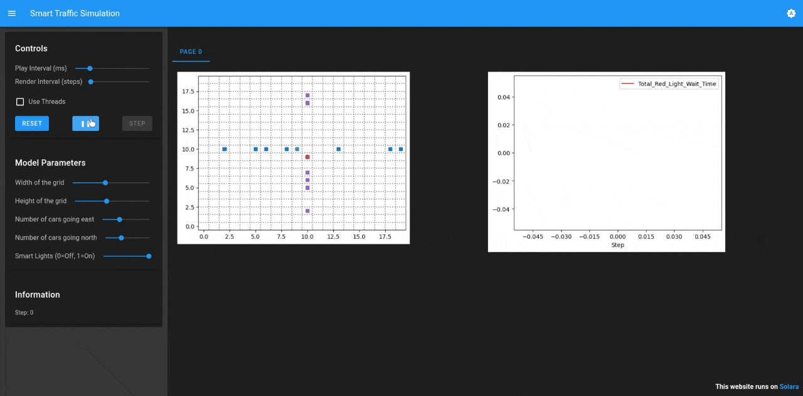

# Agent-Based Models

## Project Description
Agent-Based Models (ABMs) are computational models that simulate the actions and interactions of autonomous agents. This project contains two very simple examples implemented using mesa python package.

## Model List

### 1. Disease on Network

This model simulates the spread of an infectious disease through a social or physical network. It demonstrates how network topology (who is connected to whom) affects the speed and reach of an outbreak.


### 2. Smart Traffic Lights

An optimization simulation where traffic light agents use local information to minimize vehicle wait times at intersections.



## Features
Both models have implemented a Solara visualization script and a normal python script for fast parameter testing.


## Installation Instructions
To install the project, you can clone the repository and install the required dependencies. Make sure you have Python 3.x installed.

```bash
git clone https://github.com/FedericoCelauro/Agent-Based-Models.git
cd Agent-Based-Models
pip install -r requirements.txt

