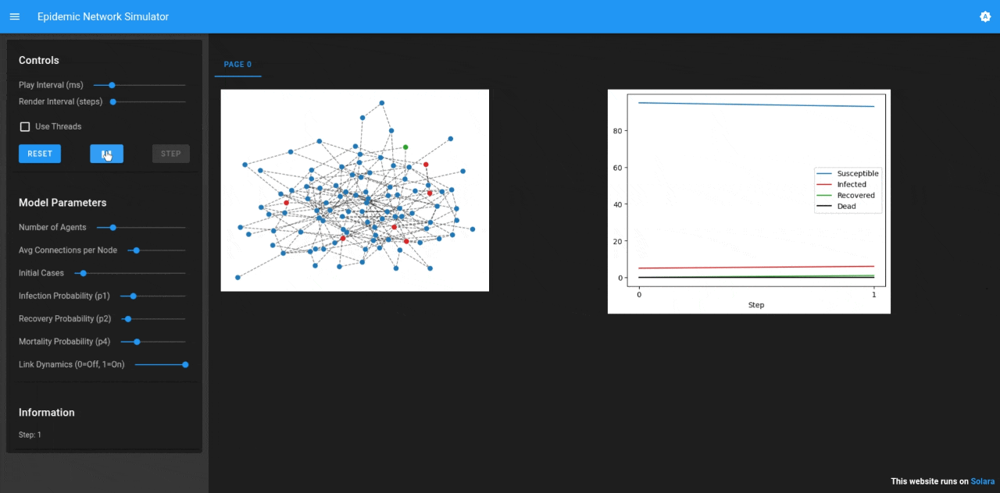

# Disease on Network

## Summary

This model simulates the spread of an infectious disease through a social or physical network. It demonstrates how network topology (who is connected to whom) affects the speed and reach of an outbreak.



## Installation

To install the dependencies use pip and the requirements.txt in this directory. e.g.

```
    $ pip install -r requirements.txt
```


Then open your browser to [http://127.0.0.1:8521/](http://127.0.0.1:8521/), select the model parameters, press Reset, then Start.

## Files

* ``disease_on_network/agent.py``: Defines the PersonAgent class.
* ``disease_on_network/model.py``: Defines the IllnessModel model and the DataCollector functions.
* ``run_example.py``: Script to compare the disease evolution with and without dynamic links.
* ``app.py``: Visualization script with Solara.
