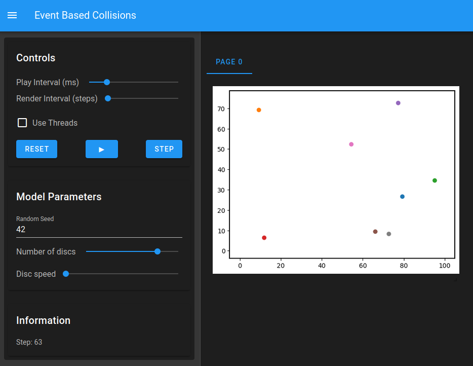

# Event Based Collisions



This model is a simple physics simulation.
Several discs move about in a 2D space, bouncing off the border and each other, though always maintaining a constant speed.
What makes this model special is its event-based approach:
Instead of detecting disc collisions each time step when they happen, collisions are mathematically predicted ahead of time and scheduled as an event on a continuous timeline.

This ensures that collisions are always accurately resolved, even when the discs are very fast compared to the step interval.
Other approaches to collision detection would fail in this scenario:
Discs could pass through each other if they only collide between time steps.
Overall, this is a playful demonstration of Mesa's ability to do event-based simulation on a non-discrete timeline.


## Running the simulation

Create a virtual environment with the packages in `requirements.txt` installed and then run:

```
solara run app.py
```


## How it works
1. Discs are placed in the space with a random movement direction.
2. At the beginning and whenever a disc changes its trajectory, the disc calculates when it could collide with an obstacle (other discs or the border) and schedules these as future events.
3. When such an event occurs and the disc still has the same trajectory (it hasn't collided with something else) then it changes its trajectory based on its angle of incidence.
4. Each full time step, all discs update their shown position based on their current trajectory. This doesn't update the actual model at all, it only queries the current state. Hence the simulation results are always the same, regardless of the timestep interval.


## Try it yourself
You can't actually modify the timestep interval, but you can modify the global speed of all discs, which is effectively the same thing.

1. Set the disc speed to 1 and let the simulation run for let's say 100 time steps.
2. Take a screenshot of where all the discs are after 100 steps.
3. Turn the disc speed up to 10 and reset the simulation.
4. Now let the simulation run only 10 time steps.
5. Compare the result with your screenshot. It should be exactly the same!
