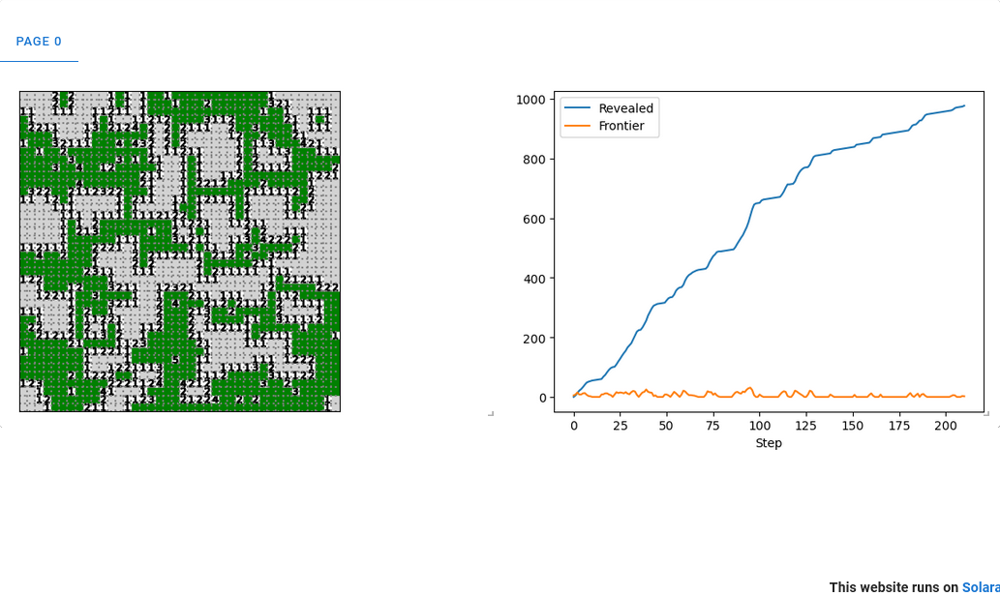

## Minesweeper

This example demonstrates a **step-based, autonomous Minesweeper model** implemented using the Mesa framework.



---

### Overview

Minesweeper is a classic grid-based puzzle game in which cells may contain hidden mines, and each revealed cell displays the number of neighboring mines.

In this example, Minesweeper is implemented as a **cellular process** that reveals itself over time without user input. The model uses local rules and neighborhood interactions to propagate information across the grid.

---

### Key features

- **Step-based dynamics:**
  The model evolves in discrete steps, revealing cells gradually using a frontier-based propagation mechanism.

- **One agent per cell:**
  Each grid cell is represented by a `MineCell` agent that stores its revealed state and number of neighboring mines.

- **Frontier-based propagation:**
  A *frontier* tracks which cells are actively being processed at each step, allowing wave-like expansion similar to flood-fill algorithms.

- **Automatic reseeding:**
  When a revealed region finishes expanding, the model automatically selects a new unrevealed safe cell and continues the process.

- **Quantitative analysis:**
  A `DataCollector` tracks the number of revealed cells and the size of the active frontier over time.

- **Matplotlib visualization:**
  The grid and time-series plots are rendered using Mesa’s Matplotlib-based visualization components.

---

### Model behavior

At each step:

1. Cells in the current frontier are revealed.
2. If a revealed cell has zero neighboring mines, its neighbors are added to the next frontier.
3. Numbered cells form boundaries and do not propagate further.
4. When a region finishes expanding, a new safe cell is selected to start another reveal wave.
5. The model terminates when no unrevealed safe cells remain or a mine is revealed.

---

### Visualization

The Solara visualization includes:

- **Grid view:**
  - Green squares: unrevealed cells
  - Gray squares: revealed empty cells
  - Numbers: neighboring mine counts
  - Red X: mine (if revealed)

- **DataCollector plot:**
  - **Revealed:** total number of revealed cells over time
  - **Frontier:** number of active cells being processed per step

---

### Getting Started

#### Prerequisites

- Python 3.10 or higher
- Mesa 3.0 or higher
- NumPy

#### Running the Model

Navigate to the example directory and run:

```bash
solara run app.py
