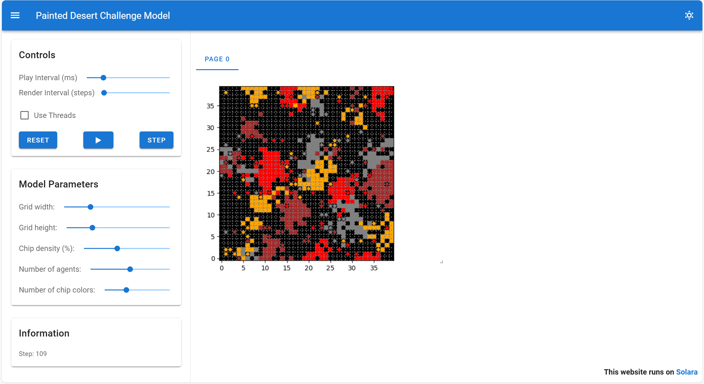

# Painted Desert Challenge Model



This is a Mesa implementation of the NetLogo model [Painted Desert Challenge](https://www.netlogoweb.org/launch#https://www.netlogoweb.org/assets/modelslib/Sample%20Models/Computer%20Science/Painted%20Desert%20Challenge.nlogox), which is an extension of the classic Termites model. The model demonstrates how simple agent behaviors can lead to emergent complex patterns, specifically the sorting of colored wood chips into separate piles.

## What is it?

In the basic Termites model, agents follow simple rules that result in them moving all wood chips into a single pile. The Painted Desert Challenge adds the dimension of multiple types (colors) of wood chips, with the goal of getting the agents to sort each chip type into its own pile.

## How it Works

Each chip collector agent (representing a termite) follows these simple rules:

1. **Search for a chip**: Agents wander randomly until they find a wood chip of their assigned color.
2. **Pick up the chip**: When an agent finds a matching chip, it picks it up and moves away from that spot.
3. **Find a similar chip**: The agent continues wandering until it finds another chip of the same color.
4. **Deposit the chip**: When near a similar chip, the agent looks for an empty space nearby and deposits its chip there.

With these simple rules, the wood chips eventually become sorted into distinct piles by color, demonstrating emergent order from decentralized decision-making.

## Model Parameters

The model includes several adjustable parameters:

- **Grid width**: Width of the simulation grid (20-100)
- **Grid height**: Height of the simulation grid (20-100)
- **Chip density**: Initial density of wood chips as a percentage (10-90%)
- **Number of agents**: Number of chip collector agents (50-250)
- **Number of chip colors**: Number of different chip colors (2-14)

## Visualization

The Solara-based visualization shows:
- **Empty patches**: Black squares
- **Wood chips**: Colored squares based on their type
- **Agents**:
  - White when not carrying a chip
  - Colored to match the chip they're carrying when transporting one

## How to Run

1. Install dependencies:
   ```bash
   pip install mesa[rec]
   ```

2. Run the app:
   ```bash
   solara run app.py
   ```

## Code Structure

The model is organized into the following files:

- **painted_desert/model.py**: Contains the `ChipCollectorModel` class that sets up the grid, initializes patches with chips, and manages the simulation
- **painted_desert/agents.py**: Contains the `ChipCollector` class that defines agent behavior
- **app.py**: Sets up the Solara visualization interface

## Things to Notice

- **Emergent sorting**: Watch as the randomly distributed colored chips gradually organize into distinct colored piles
- **Pile dynamics**: Piles are not "protected" - agents will sometimes take chips from existing piles, which helps merge smaller piles into larger ones
- **Round piles**: The final piles tend to be roughly round in shape
- **Decreasing pile count**: Over time, the number of piles generally decreases as smaller piles are merged into larger ones

## Key Concepts Demonstrated

- **Emergent behavior**: Complex patterns arising from simple individual rules
- **Self-organization**: Agents organizing their environment without central coordination
- **Decentralized systems**: No single agent is in charge, yet the system as a whole accomplishes a complex task
- **Agent-based modeling**: Simulating individual behaviors to study system-level outcomes

This model is an excellent example of how simple local interactions can lead to sophisticated global patterns, a common theme in complex adaptive systems.