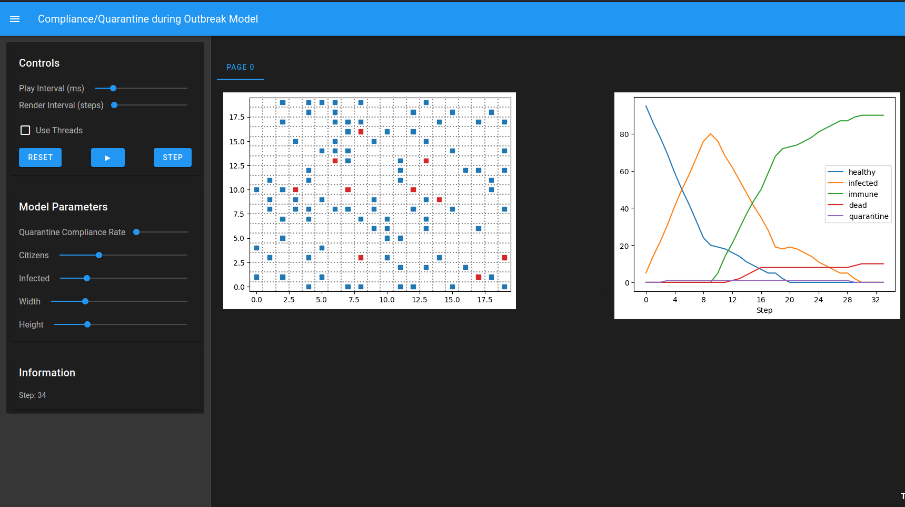
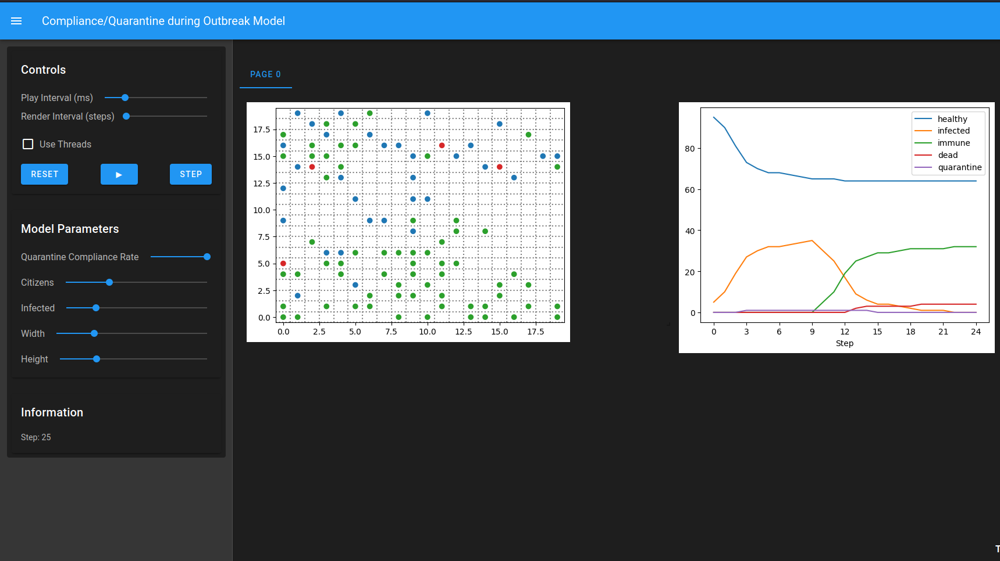
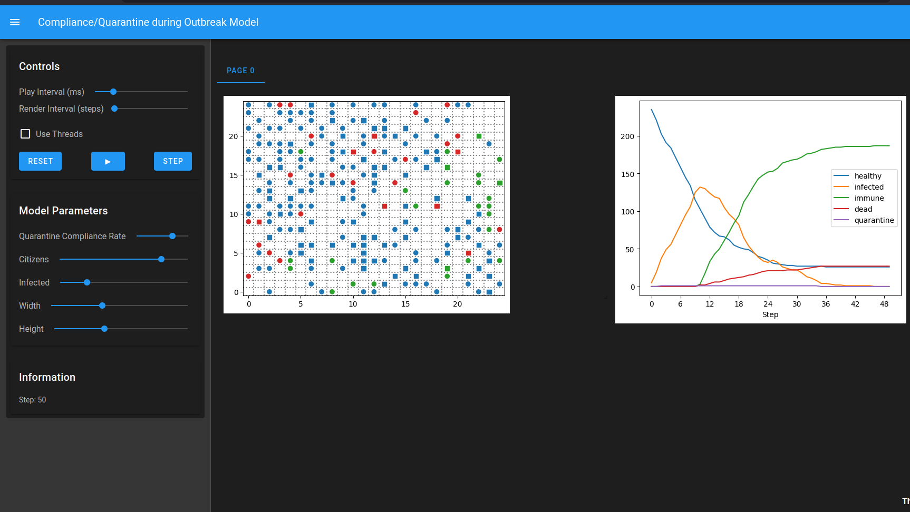
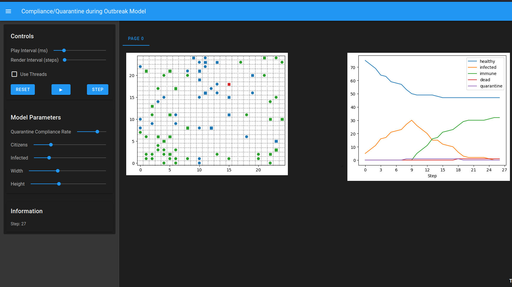

# Pathogen Outbreak & Quarantine Compliance Model

A fast-spreading pathogen outbreak model with no exposed/latency period  
inspired loosely from the game Plague Inc, though the goal here is containment 
rather than world domination. The model simulates how quarantine 
compliance rates at the population level affect outbreak dynamics, 
analyzing changes in infection, death and immunity rates.

**It showcases:**

- **Two-threshold quarantine system** - quarantine triggers when infected 
  count exceeds an upper threshold and lifts only when it drops below a 
  lower one, preventing quarantine from lifting the moment a single agent 
  recovers 
- **Compliance rate** - a configurable fraction of citizens actually follow 
  quarantine orders, attempting to simulate real-world partial adherence. The rest 
  (shown as squares) keep moving freely by not following quarantine instructions.
- **Flee behaviour** — compliant healthy agents moves away from quarantined zones during lockdown.
- **Infected agents freeze** — simulating a government isolating/quarantining an infected 
  zone. Non-compliant agents ignore this entirely.
- **Emergence of different outcomes** — combination of different configurations produce dramatically different outbreak curves.

## How It Works

1. **Initialization** — citizens are placed randomly on a MultiGrid. 
   A configurable number are set initially as infected.
2. **Disease Spread** — each step, healthy agents check their neighbours including diagonals. 
   If any are infected, there is a configurable chance of transmission. 
   No latency period — infection is immediate on contact,chance of getting an infection is 60%.
3. **Quarantine System** — the model monitors total infected count each step. 
   When it exceeds the upper threshold, quarantine activates. It only lifts 
   when infected drops below the lower threshold.
4. **Agent Behaviour during Quarantine:**
   - Compliant agents(circles) - use Manhattan distance  
     to flee away from all infected agents.
   - Non-compliant agents(squares) — move randomly, ignoring quarantine
   - Infected agents - compliant ones, freeze in place, simulating isolation or a lockdowned zone
5. **Recovery** — after 10 steps of infection, agents recover to full 
   immunity or die with the probability of 10%. Dead agents remain 
   on the grid as red circles/squares(this is an intentional mechanic) as a visual indicator to assess how compliance affects the compliant as well as non-compliant groups.

## Interesting Cases to Observe

| Scenario | Parameters | What to observe |
|----------|-----------|-----------------|
| No compliance | `compliance=0.0` | Unconstrained outbreak, maximum spread |
| Full compliance | `compliance=1.0` | Quarantine collapses the outbreak |
| Partial compliance | `compliance=0.5` | Realistic middle ground |
| Late quarantine | `quarantine_threshold_strt=60` | Triggers too late to matter |
| Dense population | `n=240, width=25` | Flee behaviour is constrained by crowding and even quarantine doesn't help |
| Sparse population| `n=70, width=25` | May stop the outbreak almost immediately or sometimes quarantine doesn't trigger this causes slow wide spread infection|

The model proposed here is simple and often can provide some quite unexpected outcomes in certain configurations. It is recommended to play around with the model parameters as outcomes can be dramatic even with small changes.

| Compliance = 0.0 | Compliance = 1.0 |
|-----------------|-----------------|
|  |  |

| Dense Population (n=240, width=25) | Sparse Population (n=80, width=25) |
|-----------------------------------|-----------------------------------|
|  |  |

## Usage
```
pip install -r requirements.txt
solara run app.py
```

## Default Parameters

| Parameter | Description | Default |
|-----------|-------------|---------|
| `n` | Number of citizens | 100 |
| `infn` | Initially infected | 5 |
| `width` / `height` | Grid dimensions | 20 x 20 |
| `spread_chance` | Transmission probability on contact | 0.6 |
| `death_chance` | probability of death after infection(only once) | 0.1 |
| `compliance` | Fraction of citizens who follow quarantine | 0.25 |
| `quarantine_threshold_strt` | Infected count that triggers quarantine | 25 |
| `quarantine_threshold_stp` | Infected count that lifts quarantine | 5 |