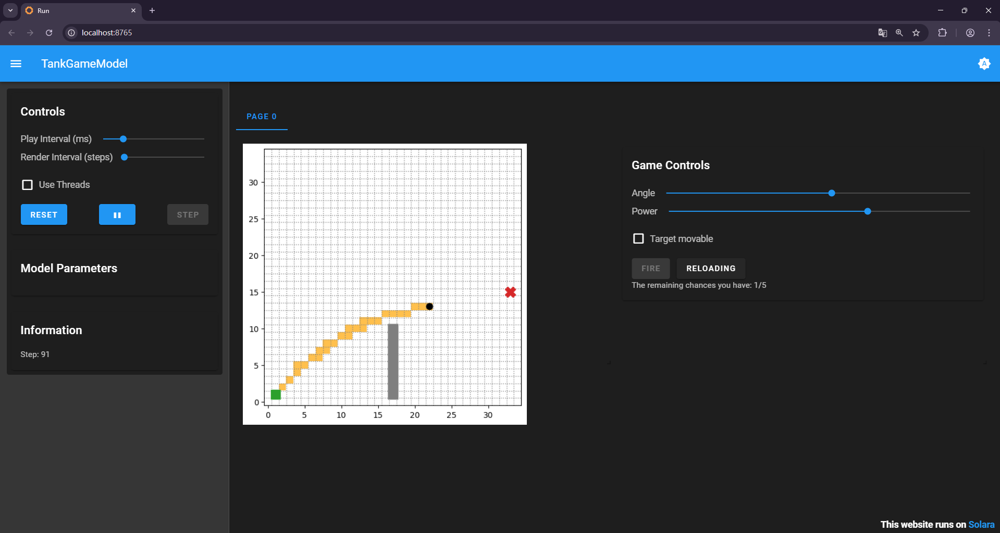

# Projectile Attack GAME

## 1. Overview
A simple 2D projectile game built with Mesa for simulation and Solara for visualization. Control a stationary tank on the left, fire shells with adjustable angle and power to hit the target. Includes an optional moving target, a fixed wall obstacle, and a trajectory trace.

## 2. Rule
- Only one shell can exist at a time; press Fire to launch when no shell is active.
- Shell motion follows gravity.
- Hitting the ground, leaving the grid, or striking the wall removes the shell; hitting the target ends the round and shows a win message.
- You have at most 5 shots; after all shots are used, the game stops and asks you to reset.
- If target movement is enabled, it moves vertically every 3 steps within bounds (y from 1 to 25, clamped to grid height).
- The wall is fixed at x=17 with height 10 (from y=1 to y=10).

## 3. Installation
Prerequisites: Python 3.11+.
- Clone the repo, then install dependencies defined in `pyproject.toml`.
- With uv (recommended): `pip install uv` then `uv sync`.

## 4. Project Structure
```
projectile_attack/
├─ README.md
├─ pyproject.toml
├─ agents.py
├─ model.py
└─ run.py
```
- `agents.py`: defines Tank, Shell, Target, Wall.
- `model.py`: builds the Mesa model, grid, wall, trajectories, firing mechanics, and win/lose state.
- `run.py`: Solara UI for controls, rendering the grid and overlays, and user interactions.

## 5. Running the GAME
- From the project root: `solara run run.py`
- First, click the "Pause" button on the left to start the simulation. One simulation can be regarded as one game. In one game, you have five chances to fire the cannonball. Hitting the target is considered a success in this game, otherwise it is a failure. After the game ends, you can click the "Reset" button on the left to reset and start the next game.
- For each launch, you can adjust sliders (angle, power), then press Fire. If the "Fire" button is gray and unclickable, remember to click the "Reloading" button beside it.
- You can also make the target move to increase the difficulty.

## 6. Game interface


