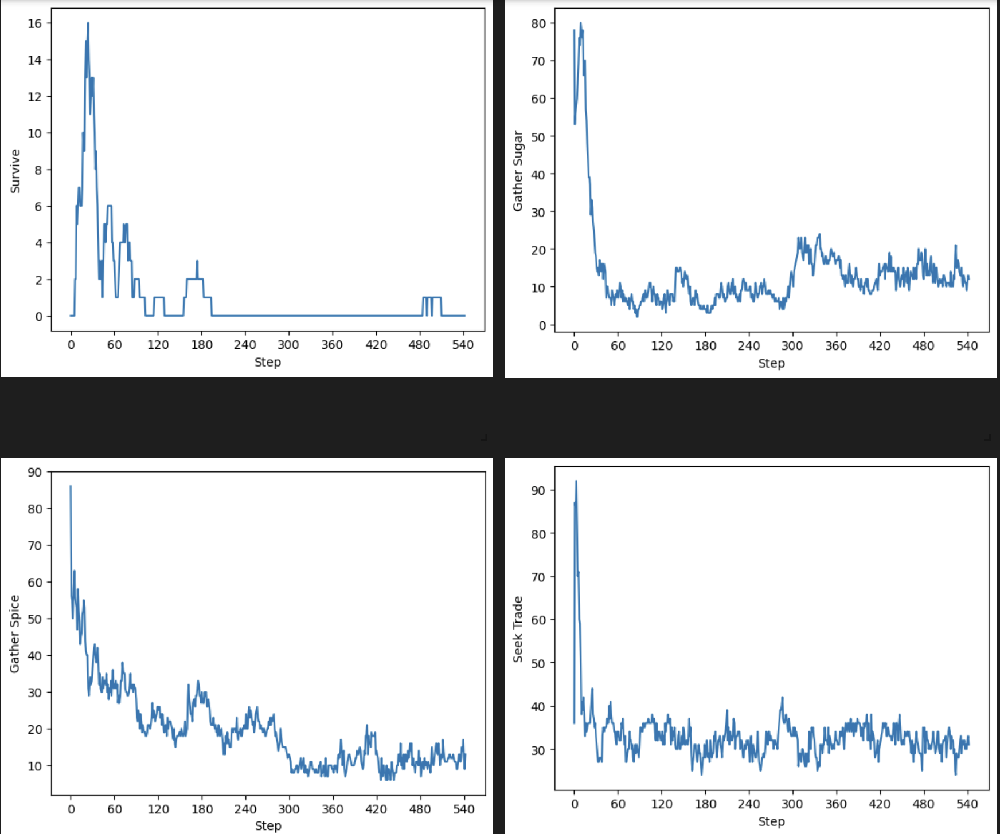
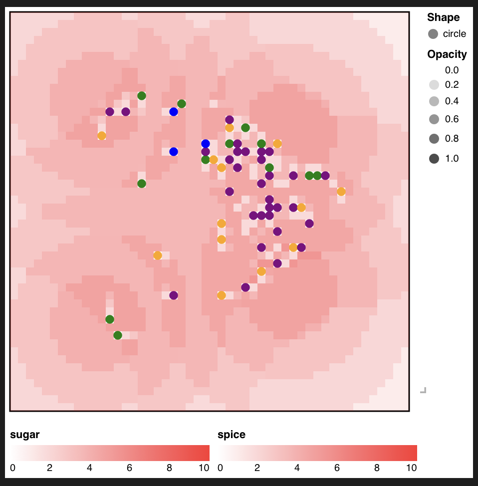

# Sugarscape: Drive-Based Agent Architecture

## What This Model Does

This project implements three versions of Epstein & Axtell's Sugarscape with Traders model, each with the same intended agent behaviour but a different internal architecture:

1. **Original** - Mesa's built-in Sugarscape G1MT. Agents follow a fixed action sequence (move -> eat -> trade) every tick with no internal decision-making about what they should prioritise.

2. **Monolith** - Adds four internal drives (survive, gather sugar, gather spice, seek trade) that change how agents move and whether they trade or not. It is named "Monolith" as all the drive logic is crammed into `step()` and `move()` using if/elif chains.

3. **Behavioural** - The same four drives, refactored into separate 'Behaviour' classes. Each behaviour defines its own urgency scoring and action sequence. The agent's `step()` selected the highest-scoring behaviour and delegates to it.

The point of this model is not to just build a better Sugarscape. It is to show, with data, that how you structure agent decision-making can change the results emerging from the model. It is also to show that currently Mesa has no clean way to express drive-based architectures, and that adding proper abstraction (like the Behaviour class pattern) makes models easier to extend; adding a new drive just involves adding a new class, not involving edits across multiple methods().

## Why Sugarscape

EwoutH explicitly cited Sugarscape as a pain point for the Behavioural Framework project, saying:

> "All needs get stuffed into one big step method, illustrating how badly Mesa lacks goals, tasks, or behaviour trees."

Sugarscape is also a harder test case than most examples. The bilateral MRS-based trading system (Epstein & Axtell, 1996) creates complex agent interactions: agents compute marginal rates of substitution, negotiate prices as the geometric mean of their MRS values, and trade only when both parties benefit.

In a Complexity Explorer session on the Sugarscape model (that I stumbled across trying to research the model on Youtube), co-creator Rob Axtell explained that decentralised bilateral trade introduces structural friction; because agents can only trade with immediate neighbours rather than seeking optimal partners globally, trade volume is suppressed below what classical supply-and-demand theory predicts. The price converges roughly correctly, but the quantity traded is lower than equilibrium. Axtell framed this bottom-up approach though as a more realistic model than the top-down "auctioneer computes market-clearing price" approach. Real markets work through local adaptive agents, not based off of central planners. However, the friction is a direct consequence of agents having no strategic trade-seeking behaviour.

This makes Sugarscape ideal for testing whether drive-based agents can reduce that friction by actively seeking for complementary trade partners, rather than passively stumbling into them.

Sugarscape's two independent resources create drive conflicts that simpler models cannot. In Wolf-sheep, there was one prey type, making the only decision possible to eat or not to eat. In Sugarscape, an agent can be desperate for sugar and comfortable on spice simultaneously, and it has two ways to address this deficit: gather the resource directly, or trade surplus spice for it. This is what makes a four-drive system meaningful.

This complexity is also what makes the architectural problem visible. With four drives, two resource types, and two acquisition methods, the if / elif chain in a monolithic `step()` grows quickly. Each new drive requires changes across `step()`, `move()`, and `trade_with_neighbors()`. This calls for an implementation of proper behavioural abstraction, to allow for scaling and easy implementation of desires for a complex problem.

## What Mesa Features it Uses

- **OrthogonalVonNeumannGrid** - 50x50 grid with Von Neumann neighbourhood (four cardinal directions)
- **PropertyLayer** - Sugar and spice distributions loaded from 'sugar-map.txt', with per-tick regrowth capped at initial max values.
- **CellAgent** - Agents bound to grid cells. Movement is handled by reassigning `self.cell`.
- **shuffle_do()** - Randomised agent activation order each tick. The original and monolith use two passes (`"step"` then `"trade_with_neighbours"`). The behavioural version uses a single pass with trading handled inside each behaviour's `act()` method.
- **DataCollector** - Tracks trader count, trade volume, geometric mean price, and drive distribution each tick
- **SolaraViz** - Interactive browser-based visualisation with agents colour-coded by active drive
- **create_agents()** - batch agent creation in model.py
- **AgentSet / model.agents** - Agent collection used in DataCollector lambdas and `shuffle_do()`for randomised activation
- **get_neighborhood()** - Vision-based cell and agent scanning. Used in every drive's cell selection and in trade partner dcisions
- **self.random / self.rng** - Mesa's built in reproducible random number generation that enables the 100-seed batch comparison with identical initial conditions across all three model versions

## The Three Versions

### Original (Mesa's built-in)

Every agent executes the same fixed sequence every tick:

```python
def step(self):
    self.move()
    self.eat()
    self.maybe_die()
```

Then the model runs a separate trading pass. The agent never decides what to do; not considering whether moving or trading is more urgent. Movement always uses the same Cobb-Douglas welfare function regardless of which resource the agent actually needs.

This isn't just a simple reflex agent though, since it already has internal state, and a utility function. However, it is a short-sighted single-step optimiser with no action selection, no drive prioritisation and no ability to skip or reorder actions

### Monolith (drives crammed into step())

The monolith adds four drives by computing urgency values at the top of 'step()' and branching into different behaviours. This works but it creates some problems:

- **`step()` becomes a long if/elif chain** where every branch ends with the same `eat()` -> `maybe_die()` -> `return` pattern.
- **`move()` branches on a string mode parameter**, with four different cell-scoring strategies inside one method.
- **`trade_with_neighbors()` checks `self.active_drive`**, a flag set during `step()` in a completely different execution phase. The coupling is implicit.
- **Adding a new drive** means adding a branch in `step()` AND in `move()`  AND potentially in `trade_with_neighbors()`.

This is the pattern that EwoutH described, with all needs being stuffed into one big step method. The monolith acts as a problem model, showing the issues caused by the current structure when looking to extend the original model. This is used to compare against the next refactored model.

### Behavioural (drives as separate classes)

Each drive becomes a 'Behaviour' subclass with three responsibilities: `score(agent)` returns urgency, `choose_cell(agent)` selects the target cell, and `act(agent)`executes the full action sequence including movement, eating, and trading.

The Trader class has no `move()` method. Movement is fully owned by each behaviour's `choose_cell()`. The agent's `step()` reduces to:

```python
def step(self):
    self.prices = []
    self.trade_partners = []
    best = max(self.behaviours, key=lambda b: b.score(self))
    self.active_drive = best.name
    best.act(self)
```

Adding a new drive means you only have to write one new class and append it to `self.behaviours`. No changes are needed for the Trader class, model, or any other behaviour. This allows for easy expansion of the model to add any drives. The decoupled Behaviour classes could also serve as leaf nodes in a behaviour tree or as actions within a goal-based planning system, since each is self-contained with its own scoring, cell selection, and action sequence. The flat max-score selection mechanism would need to be replaced with a hierarchical selector or planner, but the building blocks it selects between are ready to be reused.

## The Drives

Each drive computes a score based on the agent's current state. The highest-scoring
drive wins and controls the agent's behaviour for that tick.

**Survive** — Fires when either resource is critically low. The agent moves greedily
toward whichever resource is most urgent and skips trading entirely.

**Gather Sugar / Gather Spice** — Activates when one resource has fewer ticks of
reserves than the other. The agent targets cells rich in the needed resource, using
welfare as a tiebreaker between equal options. Trades opportunistically if neighbours
are nearby.

**Seek Trade** — Activates when both resources are comfortable but imbalanced. The
agent moves toward cells near complementary traders — agents who have surplus of
what it needs. This is the drive that directly addresses Axtell's friction.

**Default** — Fallback when resources are roughly balanced. Uses the original
welfare-maximising movement from Epstein & Axtell.

### Drive Distribution over time

- **Steps 0–60:** Gather Sugar and Gather Spice dominate as agents start with random endowments and immediately prioritise whichever resource they lack. Survive spikes briefly as some agents hit critical levels. There is a rapid die-off during this phase.
- **Steps 60–120:** Gather drives drop as agents die or stabilise, with Survive falling to near zero.
- **Steps 120+:** Seek Trade becomes the most common drive. Surviving agents are comfortable enough that their primary activity is rebalancing through trade. Gather drives persist at low levels as agents occasionally top up a resource.

This emergent shift — from resource desperation to trade-seeking — falls naturally out of the scoring functions without any explicit phase logic.



## Results

The batch_run.py class is used to compare the final results of each model with reliability through repetition, taking the results and the standard deviations of each.

100-seed batch comparison, 500 steps per run, 200 initial agents.

| Metric | Original | Monolith | Behavioural |
|---|---|---|---|
| Survival rate | 0.310 ± 0.033 | 0.314 ± 0.032 | 0.291 ± 0.030 |
| Final alive | 61.9 ± 6.7 | 62.8 ± 6.5 | 58.1 ± 6.0 |
| Total trades | 8,541 ± 888 | 9,046 ± 988 | 13,036 ± 1,502 |
| Final price | 1.039 ± 0.239 | 0.989 ± 0.107 | 0.996 ± 0.162 |

### Key findings

**Survival is comparable across all three versions.** The standard deviations heavily overlap, showing the drive-based agents survive at the same rate as the reactive agents. Adding these drives neither hurts nor helps survival in a statistically significant way.

**The behavioural version generates 53% more trades.** 13,036 vs 8,541, with non-overlapping standard deviations. This is the most important finding; the seek trade drive actively moves agents toward complementary partners rather than relying on random encounters. This directly reduces the bilateral trade friction described by Axtell; agents no longer just trade with whoever they happen to be near, they instead move toward agents who have what they need.

**Price convergence is tighter.** The behavioural version reaches a final price of 0.996 (closer to the theoretical equilibrium of 1.0) with lower variance than the original 1.039 ± 0.239. More trade volume means more price discovery, connecting to Axtell's point that the decentralised bottom-up view can approximate market-clearing prices. Drive-based agents get there faster because they trade more.

**The monolith and behavioural versions implement the same drives but produce different trade volumes.** The monolith generates 9,046 trades, whereas the behavioural version generates 13,036. The difference is because of execution timing.

### Execution timing matters

The monolith and behavioural versions have the same drives, the same scoring functions, and the same cell selection logic, however they produce these very different trade volumes. The difference is entirely structural.

In the monolith, the model runs two separate passes: all agents move (`shuffle_do("step")`), then all agents trade (`shuffle_do("trade_with_neighbors")`). Everyone is in their final position before any trading begins.

In the behavioural version, each agent moves and trades within their own `step()` before the next agent acts. Each trade changes both agents' resource levels, which can create new trade opportunities for agents who act later in the same tick. This cascading effect is impossible in the separated-pass approahc, where all movement is finished before any trading begins.

This was unintended. The 53% trade increase is a consequence that fell out of the architectural decision about when trading happens relative to movement. This is the kind of effect that the Behavioural Framework needs to make explicit and controllable.

## What I learned

**The original agents are smarter than they look.** My initial instinct was to frame the original as a simple reflex agent, and position my extension to adding goals. I quickly realised that would be wrong though, as the original uses a Cobb-Douglas welfare function to evaluate outcomes and select the best available cell - it is a utility based optimiser, not a reflex agent. What it lacks is not goals but temporal depth and action selection: the ability to choose between moving and trading, to prioritise one resource over another, or to pursue a strategy across multiple ticks.

**Execution timing is an architectural decision with emergent consequences.** I did not set out to increase trade volume. The 53% increase was a side effect of moving trading from a separate model pass into the agent's behaviour. This finding reinforces the case for the Behavioural Framework: when Mesa forces you to structure agent actions in a particular way (separate activation passes), it implicitly constrains what can emerge from the model. A framework that gives modellers explicit control over action sequencing would prevent these accidental effects, or let modellers create them intentionally.

**Building the monolith first made the refactor's value obvious.** If i had gone straight to the behavioural version, the clean architecture would look like over-engineering. Building the monolith first and experiencing the pain of adding any drives to an already-branching `step()` method made the case for separation strong.

**Decoupling movement from the Trader completed the separation.** The earlier behavioural version still had a shared `move()` method with string-flag branching, which was the same pattern used in the monolith model, just being called from a nicer place. Moving cell selection into each behaviour's `choose_cell()` completed the decoupling. The Trader class no longer knows how any drive makes movement decisions.

**Learning Solara changed how i debug models.** Being able to watch agents switch drives in real time (colour coded on the grid) caught issues that batch runs couldn't do. I saw that agents would get stuck in survive mode in areas with plenty of resources, with almost no agents getting being put in seek_trade mode, pointing towards a threshold problem that i was able to test and change. I learnt that solara visualisation was not just for presenting and understanding, but it's also a very useful development tool.



*Agent colours: black = survive, green = gather sugar, orange = gather spice, purple = seek trade, blue = default.*

**The batch comparison forced me to think about what to measure.** Deciding on survival rate, trade volume, and price as the comparison metrics meant understanding what each model version was actually supposed to change.

**Working with Mesa's internals gave me a stronger sense of what the Behavioural Framework needs to provide.** I hit the same architectural wall twice across two models (Wolf-Sheep and Sugarscape), adding drives that need to control movement, action selection, and trading, but Mesa only gives you `step()` and `shuffle_do()`. The Behaviour class pattern I built is a workaround for what should be a first-class Mesa abstraction. Building the model myself means I understand what the framework needs to replace and why.

## What Was Hard

**Mesa's API is changing rapidly.** The installed version's PropertyLayer, DataCollector, and Model constructor signatures all differ from what the documentation and built-in examples show. The built-in Sugarscape G1MT example itself has bugs (the `max()` crashes on empty welfare lists, the KeyError in the datacollector). This was the most frustrating part in the building process, spending time debugging the API mismatches rather than building the model.

**The seek trade cell scoring is expensive.** For each candidate cell, the agent scans all traders within vision of that cell to count complementary partners. With 200 agents and vision up to 5, this is a lot of nested iteration. It works for 50x50 grids but would not scale well. A Behavioural Framework implementation might use spatial indexing or cached neighbour lookups.

**Getting the three versions to produce a fair comparison was tricky** The original uses Mesa's Scenario class; the monolith and behavioural use plain constructor parameters. The original and monolith separate movement and trading into two activation passes, whereas the behavioural model interleaves them. These structural differences affect outcomes in ways that are hard to control for. In the batch comparison, I used the same seeds, same grid size, same initial parameters, and same step count, but the execution order difference remains a confounding factor, and is in itself a finding.

**Drive thresholds and principled justification**
The values for `CRITICAL_THRESHOLD`, `COMFORTABLE_THRESHOLD`, and `IMBALANCE_RATIO` are currently hand-tuned. A sensitivity analysis varying these thresholds and measuring their effect on survival and trade volume would strengthen the results. This is something I would add given more time

## Future Directions

The drive system built here is the simplest useful architecture; each tick you score all drives, pick the highest, and then execute. This is enough to demonstrate the problem and produce measurable emergent differences, but it is not the end of the road.

**Goal-based agents with multi-step plans.** The current drives are reactive, re-evaluating every tick. A goal-based agent would commit to a plan ("move to the spice hills over the next 5 ticks") and would only re-evaluate when the goal is achieved or an interrupt fires. This adds temporal depth, making the agent's current action, with the agent's current action depending on decisions made several ticks ago. Sugarscape is well-suited for this because the landscape has resource-hills, so an agent could form a plan to reach one rather than taking a cell-by-cell greedy approach.

**Behaviour trees.** Currently, the `max(score)` selection in the behavioural model is flat, with every drive competing equally. A behaviour tree would add hierarchical structure: a top-level selector could choose between "survival subtree" and "economic subtree" where the economic subtree has its own selector between gathering and trading. This would make complex decision logic composable and inspectable, rather than relying on numeric score comparisons.


**Adaptive trade behaviour** Trade behaviour could also become drive dependent, meaning a desperate agent could accept worse trading terms, or a comfortable agent could hold out for better terms. A drive's `act()` could pass modified parameters to the trade logic, but this has not yet been implemented.

These directions map onto a progression of agent architectures from Russell & Norvig: reactive -> drive-based (this model) -> goal-based -> utility-based -> learning. Each state adds a capability that Mesa currently cannot express natively. The Behavioural Framework's job is to make all of them possible without forcing modellers to reinvent the abstractions each time.

## How to Run

### Requirements

```
pip install mesa[rec] numpy pandas
```

### Visualisation (Solara)

```bash
# Original
cd models/sugarscape/original
solara run original_app.py

# Monolith
cd models/sugarscape/monolith
solara run monolith_app.py

# Behavioural
cd models/sugarscape/behavioural
solara run behavioural_app.py
```

### Batch comparison

```bash
cd models/sugarscape
python batch_run.py
```

Runs all three models across 100 seeds (500 steps each). Outputs a side-by-side comparison table and saves raw data to `batch_comparison.csv`.

### Individual runs

```bash
cd models/sugarscape/monolith
python monolith_run.py
```

## File Structure

```
sugarscape/
├── batch_run.py              # 100-seed comparison across all three models
├── sugar-map.txt             # Landscape data (shared)
├── original/
│   └── original_app.py       # Solara viz for Mesa's built-in model
├── monolith/
│   ├── monolith_agents.py    # Drives crammed into step() and move()
│   ├── monolith_model.py     # Model with drive distribution tracking
│   ├── monolith_run.py       # Single-run output
│   └── monolith_app.py       # Solara viz with drive-coloured agents
└── behavioural/
    ├── behavioural_agents.py # Drives as Behaviour classes with choose_cell()
    ├── behavioural_model.py  # Model with single-pass execution
    └── behavioural_app.py    # Solara viz with drive-coloured agents
```


