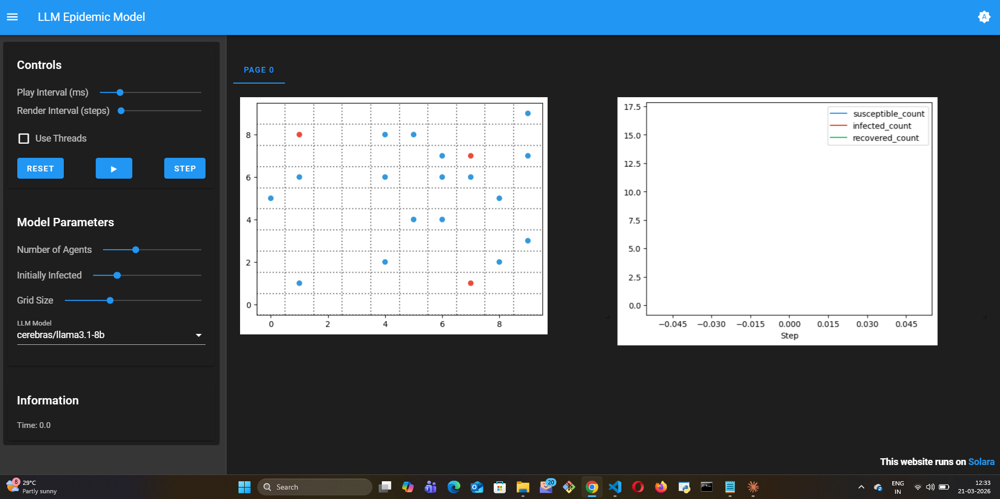
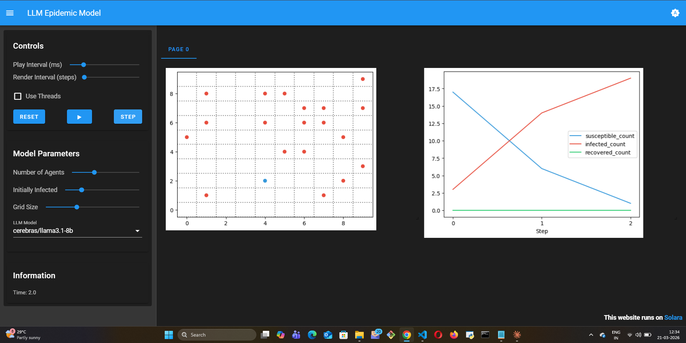

# LLM Epidemic Model

## Summary

A classic SIR (Susceptible-Infected-Recovered) epidemic simulation where agents use
**LLM Chain-of-Thought reasoning** to decide their behavior during an outbreak —
instead of following fixed stochastic transition probabilities.

Unlike traditional SIR models, agents here _reason_ about their situation — weighing
personal health risk, observed neighbor states, and community responsibility — before
choosing an action.

## The Disease Dynamics

Each agent is in one of three states:

| Color | State | Behavior |
|-------|-------|----------|
| 🔵 Blue | Susceptible | Healthy, can be infected by neighbors |
| 🔴 Red | Infected | Sick, reasons about isolation vs. movement |
| 🟢 Green | Recovered | Immune, moves freely |

At each step, infected agents decide whether to isolate or continue moving. Susceptible
agents assess neighbor states and choose how cautiously to behave. These decisions,
driven by LLM reasoning rather than probability parameters, shape the epidemic curve.

## What makes this different from classical SIR

Classical SIR uses fixed β (transmission rate) and γ (recovery rate). The epidemic curve
is fully determined by these two numbers.

Here, agents **reason** at each step:

> "I am infected. My neighbors include susceptible individuals. Continuing to move
> freely risks spreading the disease. I should isolate — even though it limits my
> mobility — to protect the community."

This produces **behavioral heterogeneity**: some agents isolate immediately, others
rationalize continued movement. The macro curve still follows SIR dynamics, but
the shape reflects individual decision-making, not just probabilities.

## Visualization

**Step 0 — Initial seeding (3 infected, 17 susceptible):**



**Step 3 — Epidemic accelerating (curves crossing):**



**Step 13 — Full SIR arc complete (all recovered):**


| Step | Susceptible | Infected | Recovered | Event |
|------|-------------|----------|-----------|-------|
| 0 | ~17 | ~3 | 0 | Initial seeding |
| 1–2 | Falling fast | Rising | 0 | Epidemic accelerating |
| 3 | ~5 | ~18 | ~0 | Near-peak — curves cross |
| 5–7 | ~0 | ~20 | ~0 | Saturation — everyone infected |
| 10+ | 0 | Falling | Rising | Recovery phase begins |
| 13 | 0 | ~0 | ~20 | Full recovery — epidemic over |

**Why this matters:** This is the textbook Kermack-McKendrick (1927) SIR curve reproduced
with **zero hardcoded β or γ parameters**. The epidemic arc — seed → spread → peak →
recovery — emerges entirely from LLM reasoning about individual health decisions.
An infected agent that reasons "I should isolate" slows the curve. One that doesn't
steepens it. Classical SIR cannot represent this individual behavioral variation at all.

## How to Run

```bash
cp .env.example .env  # fill in your API key
pip install -r requirements.txt
solara run app.py
```

## Supported LLM Providers

Gemini, OpenAI, Anthropic, Ollama (local) — configured via `.env`.

## Reference

Kermack, W. O., & McKendrick, A. G. (1927). A contribution to the mathematical
theory of epidemics. *Proceedings of the Royal Society of London. Series A*,
115(772), 700–721.
