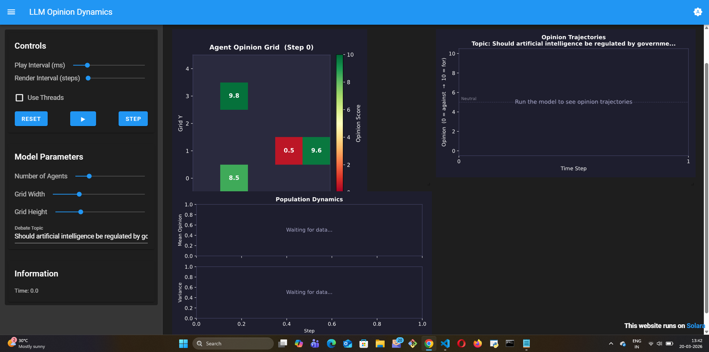
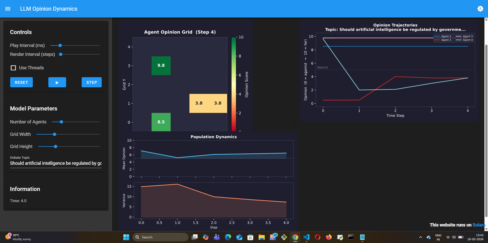

# LLM Opinion Dynamics

An agent-based model of opinion dynamics powered by large language model (LLM) agents, built with [Mesa](https://github.com/projectmesa/mesa) and [Mesa-LLM](https://github.com/projectmesa/mesa-llm).

## Overview

Classical opinion dynamics models like [Deffuant-Weisbuch](../deffuant_weisbuch/) use mathematical rules to update agent opinions — if two agents are close enough in opinion, they converge by a fixed amount. While elegant, this misses the richness of real human persuasion.

This model replaces the math with genuine LLM reasoning. Each agent:
1. **Observes** its neighbors' current opinion scores
2. **Reasons** about whether their arguments are convincing
3. **Updates** its opinion score based on the quality of reasoning — not just proximity

This produces emergent behaviors that classical models cannot capture:
- Agents can be **stubbornly resistant** to persuasion even when numerically close
- Agents can **leap across** opinion gaps if an argument is compelling enough
- **Polarization** and **consensus** emerge from genuine reasoning, not formulas

## The Model

Agents are placed on a grid. At each step:
- Each agent observes its Moore neighborhood (up to 8 neighbors)
- It constructs a prompt summarizing neighbor opinions
- The LLM (e.g. Gemini Flash) reasons about whether to update its opinion
- The new opinion score (0-10) is extracted and stored

### Parameters

| Parameter | Description | Default |
|-----------|-------------|---------|
| `n_agents` | Number of agents | 9 |
| `width` | Grid width | 5 |
| `height` | Grid height | 5 |
| `topic` | The debate topic | AI regulation |
| `llm_model` | LLM model string | `gemini/gemini-2.0-flash` |

## Running the Model

Set your API key:
```bash
export GEMINI_API_KEY=your_key_here
```

Install dependencies:
```bash
pip install -r requirements.txt
```

Run the visualization:
```bash
solara run app.py
```

## Visualization

The Solara dashboard shows three live panels:

| Panel | What it shows |
|-------|--------------|
| **Agent Opinion Grid** | Heatmap of agent opinions on the spatial grid (red = against, green = for) |
| **Opinion Trajectories** | Per-agent opinion over time — reveals convergence, divergence, and stable minorities |
| **Population Dynamics** | Mean opinion + variance — declining variance signals emergent consensus |

**Initial state (Step 0):**



**After 4 steps of LLM-driven persuasion:**



Notable emergent behaviors visible above:
- Agents 2 & 3 independently converged to **3.8** — emergent clustering, no hardcoded rule
- Agent 4 started at **9.6**, was persuaded by a neighbor at **0.5**, and moved to **2.0** in one step
- Agent 1 (spatially isolated, top of grid) held at **9.8** throughout — isolation preserves extreme opinions
- Variance declined from ~15 → ~7 across 4 steps

## Relationship to Classical Models

| Feature | Deffuant-Weisbuch | LLM Opinion Dynamics |
|---------|-------------------|----------------------|
| Opinion update rule | Mathematical (μ parameter) | LLM reasoning |
| Bounded confidence | Hard threshold (ε) | Emergent from argument quality |
| Agent memory | None | Short-term memory of past interactions |
| Persuasion mechanism | Numeric proximity | Natural language argument |

## References

- Deffuant, G., et al. (2000). *Mixing beliefs among interacting agents*. Advances in Complex Systems.
- Mesa-LLM: [github.com/projectmesa/mesa-llm](https://github.com/projectmesa/mesa-llm)
