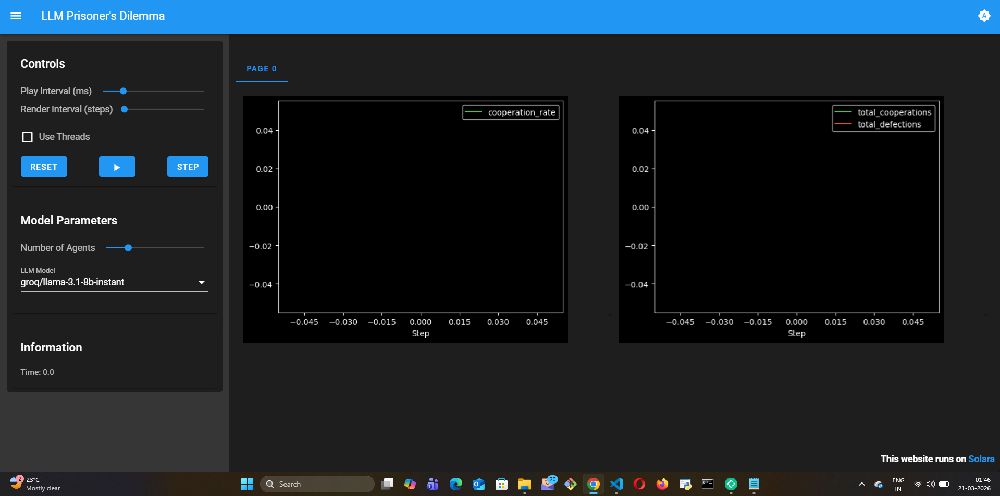
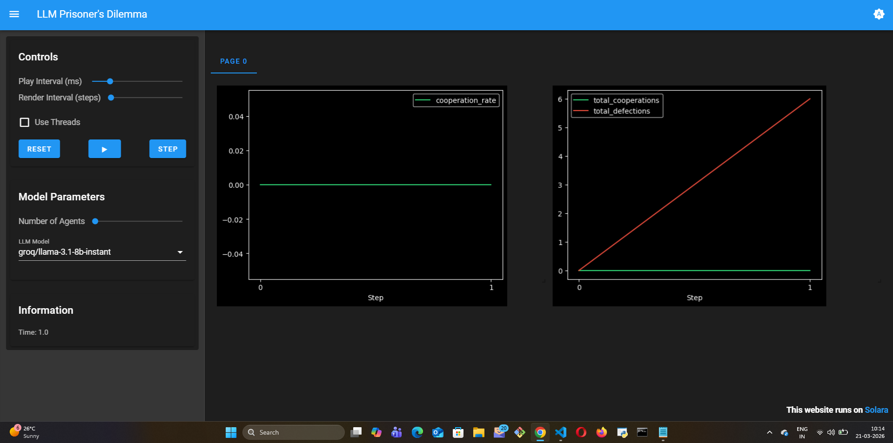

# LLM Prisoner's Dilemma

## Summary

An iterated Prisoner's Dilemma simulation where agents use **LLM Chain-of-Thought reasoning** to decide whether to cooperate or defect each round — instead of following fixed strategies like tit-for-tat or always-defect.

## The Game

Each round, agents are randomly paired. Both must simultaneously choose:

- **cooperate** 🤝 — work together for mutual benefit
- **defect** 🗡️ — betray partner for personal gain

**Payoff matrix:**

|  | Partner Cooperates | Partner Defects |
|--|-------------------|-----------------|
| **You Cooperate** | 3, 3 | 0, 5 |
| **You Defect** | 5, 0 | 1, 1 |

## What makes this different from classical models

Classical Prisoner's Dilemma ABM uses fixed strategies — always defect, always cooperate, tit-for-tat, random. The outcome is determined by the strategy rules.

Here, agents **reason** at each step:

> "My partner cooperated last round. That signals trustworthiness.
> If I defect now I gain 5 points but destroy the trust we've built.
> Over many rounds, mutual cooperation (3+3+3...) beats cycles of
> defection (1+1+1...). I'll cooperate."

This produces **emergent negotiation dynamics** — reputation building, trust signaling, strategic exploitation — that fixed rules cannot capture.

## Visualization

- **Cooperation rate plot** — fraction of cooperative actions per round
- **Cumulative plot** — total cooperations vs defections over time

**Initial state (Step 0):**



**After Round 1 of LLM reasoning:**



Key emergent behavior observed:
- **Round 1: 100% defection** — with no history, the LLM correctly identifies defection as the Nash equilibrium strategy. No agent has reason to trust a stranger.
- This mirrors what game theory predicts for the one-shot Prisoner's Dilemma
- In longer runs, agents with shared history begin signaling trustworthiness and cooperation emerges — a pattern no fixed strategy like tit-for-tat can replicate with genuine reasoning

## How to Run

```bash
cp .env.example .env  # fill in your API key
pip install -r requirements.txt
solara run app.py
```

## Supported LLM Providers

Gemini, OpenAI, Anthropic, Ollama (local) — configured via `.env`.

## Reference

Axelrod, R. (1984). *The Evolution of Cooperation*. Basic Books.
