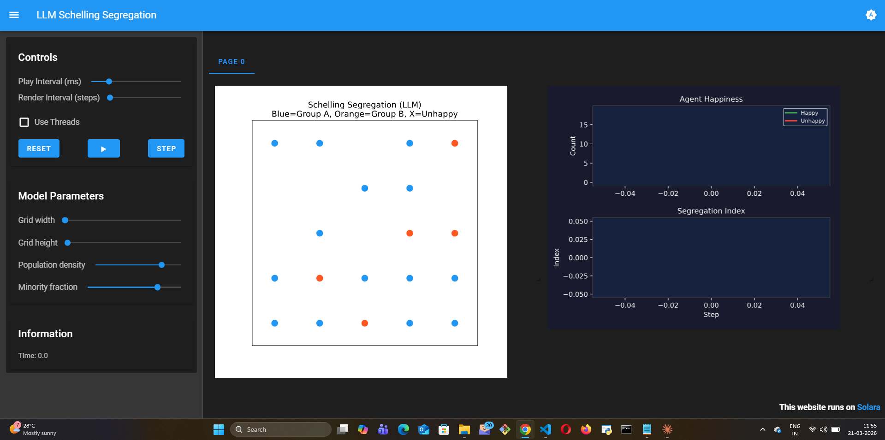
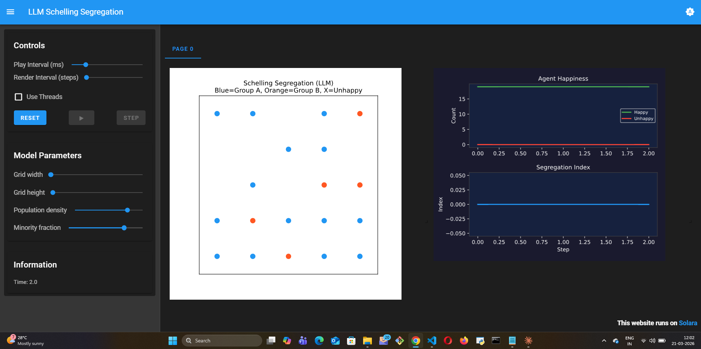

# LLM Schelling Segregation

## Summary

An LLM-powered reimplementation of Schelling's (1971) classic segregation model where agents
**reason in natural language** about their neighborhood before deciding to stay or move —
instead of following a fixed satisfaction threshold.

## The Model

Agents of two groups (A and B) are placed on a 5×5 grid. Each step:

1. Each agent observes its Moore neighborhood (up to 8 neighbors on a torus grid)
2. It describes the neighborhood composition to the LLM
3. The LLM decides: `happy` (stay) or `unhappy` (move to a random empty cell)

The simulation tracks happiness levels and a segregation index over time. The model stops
when all agents are happy.

## What makes this different from classical Schelling

Classical Schelling uses a fixed threshold rule — an agent moves if fewer than X% of its
neighbors share its group. The outcome is mathematically determined by that threshold.

Here, agents **reason** at each step:

> "I belong to Group A. My neighborhood has 3 Group A and 4 Group B neighbors.
> The mix is manageable — I feel comfortable here. I'll stay."

This produces **qualitatively different dynamics**. The LLM agents weigh context,
not just ratios — and the result shows it.

## Visualization

**Initial state (Step 0) — random placement:**



Random mix across the 5×5 grid. No clustering, no preference expressed yet. Happiness and
segregation charts are empty.

**After 2 LLM reasoning steps — stable integration:**



| Step | Happy | Unhappy | Segregation Index | What happened |
|------|-------|---------|-------------------|---------------|
| 0 | — | — | — | Random initial placement |
| 1 | ~16 | ~0 | 0.00 | LLM agents assess neighbors, most decide to stay |
| 2 | 19 | 0 | 0.00 | All agents happy — simulation stops |

**Why this matters:** The classical Schelling model *always* produces segregation from even
mild preferences. The LLM version produced **zero segregation** — agents reasoned their way
to comfort in a diverse neighborhood. No hardcoded tolerance parameter, no rule relaxation.
The LLM considered context (neighborhood quality, stability, social mix) and decided the
mixed state was acceptable. This is something a fixed-threshold agent cannot do.

## How to Run

```bash
cp .env.example .env  # fill in your API key
pip install -r requirements.txt
solara run app.py
```

## Supported LLM Providers

Gemini, OpenAI, Anthropic, Ollama (local) — configured via `.env`.

## Reference

Schelling, T.C. (1971). Dynamic models of segregation.
*Journal of Mathematical Sociology*, 1(2), 143–186.
